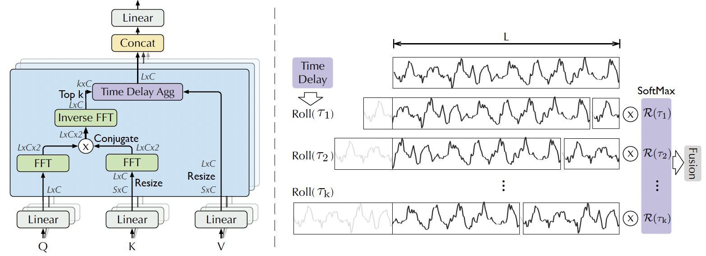

# 1. 论文介绍

## 1.1 背景介绍

​		时间序列预测在能源消耗、交通规划、经济预测、天气预测和疾病传播等领域有着广泛的应用。在这些实际应中，一个迫切的需求是将预测时间扩展到更远的未来，这对于长期规划和预警系统非常有意义。然而，长期预测面临着时间序列中复杂的时间模式所带来的挑战，这些模式可能会掩盖可靠的依赖关系，使得直接从长期时间序列中发现依赖关系变得不可靠。 

## 1.2 论文方法

《Autoformer: Decomposition Transformers with Auto-Correlation for Long-Term Series Forecasting 》

为了解决长期预测的问题，论文提出了一种名为Autoformer的新型分解架构，并引入了一种基于序列周期性的自相关机制（Auto-Correlation mechanism）。这种方法突破了传统Transformer模型的局限性，特别是在处理长期时间序列预测时的计算复杂性和信息利用瓶颈。

### 1.2.1 自相关机制（Auto-Correlation mechanism）

- **序列级别的连接**：与传统的点对点自注意力（self-attention）不同，Auto-Correlation机制在序列级别上进行操作，通过计算自相关来发现基于时间延迟的相似子序列，并通过时间延迟聚合来聚合这些子序列。
- **效率和准确性**：这种机制在效率和准确性方面都优于自注意力机制，因为它能够在保持计算效率的同时，更好地利用信息。

### 1.2.2 分解架构（Decomposition Architecture）

- **时间序列分解**：Autoformer将时间序列分解为趋势周期部分和季节性部分，这种分解有助于提取更可预测的组成部分。
- **逐步分解能力**：通过将分解块作为深度模型的内部操作，Autoformer能够逐步提取长期趋势信息。

### 1.2.3 创新点

相较于传统模型，Autoformer的创新之处在于：

1. **分解架构**：将分解技术内化为深度预测模型的一部分，而不是仅仅作为预处理步骤。
2. **自相关机制**：代替了传统的自注意力机制，通过序列周期性发现依赖关系，提高了信息的利用效率。
3. **计算复杂度**：Auto-Correlation机制实现了O(L log L)的复杂度，这对于长序列预测来说是一个显著的改进。

## 1.3 数据集

### 1.3.1 数据集介绍

论文中使用了以下六个真实世界的数据集来评估Autoformer的性能：

1. **ETT数据集**：包含从电力变压器收集的数据，如负载和油温，每15分钟记录一次。
2. **Electricity数据集**：包含321名客户从2012年到2014年的每小时电力消耗数据。
3. **Exchange数据集**：记录了从1990年到2016年八个不同国家的每日汇率。
4. **Traffic数据集**：收集了加利福尼亚交通部提供的旧金山湾区高速公路上不同传感器测量的小时道路占用率数据。
5. **Weather数据集**：每10分钟记录一次2020年全年的数据，包含21个气象指标，如气温、湿度等。
6. **ILI数据集**：包含美国疾病控制和预防中心从2002年到2021年记录的每周流感样疾病（ILI）患者数据，描述了ILI患者与总患者数的比例。

这些数据集覆盖了能源、交通、经济、天气和疾病等五个主流时间序列预测应用领域。

### 1.3.2 数据集来源

​	https://github.com/zhouhaoyi/ETDataset

​	https://github.com/laiguokun/multivariate-time-series-data

​	https://gis.cdc.gov/grasp/fluview/fluportaldashboard.html

## 1.4 pipeline

### **1.4.1 深度分解框架**

​        该论文将Transformer更新为一个深度分解架构，它可以在预测过程中逐步分解趋势和季节组件。它超越了传统Transformer架构的限制，首次实现了序列级别的连接。该模型采用分解架构和自相关机制，有效处理长期时间序列预测中的复杂模式，提高了预测的效率和准确性。


<b>     										            	Figure 1.</b> Overall architecture of Autoformer.

### **1.4.2. 基于序列的相关机制**

​        该论文基于随机过程理论，设计了自相关机制，这样可以发现基于周期的依赖关系，并在系列级别上聚合信息。这赋予模型固有的对数线性复杂性。这种基于系列的连接与之前的自注意力家族有明显的区别。



<b>														     Figure 2.</b> Auto-Correlation mechansim.


# 2. mindspore实现版本

## 2.1 mindspore框架介绍

MindSpore是华为推出的一款人工智能计算框架，主要用于开发AI应用和模型。它的特点如下:

- 框架设计：MindSpore采用静态计算图设计，PyTorch采用动态计算图设计。静态计算图在模型编译时确定计算过程，动态计算图在运行时确定计算过程。静态计算图通常更高效，动态计算图更灵活；

- 设备支持：MindSpore在云端和边缘端都有较好的支持，可以在Ascend、CPU、GPU等硬件上运行；

- 自动微分：MindSpore提供自动微分功能，可以自动求导数，简化模型训练过程；

- 运算符和层：MindSpore提供丰富的神经网络层和运算符，覆盖CNN、RNN、GAN等多种模型；

- 训练和部署：MindSpore提供方便的模型训练和部署功能，支持ONNX、CANN和MindSpore格式的模型导出，可以部署到Ascend、GPU、CPU等硬件。

  

## 2.2 环境准备

使用华为HECS(云耀云服务器)，操作系统Ubuntu 22.04。

安装anaconda环境：

```
wget https://mirrors.bfsu.edu.cn/anaconda/archive/Anaconda3-2022.10-Linux-x86_64.sh --no-check-certificate
bash Anaconda3-2022.10-Linux-x86_64.sh
```

创建虚拟环境并且切换到环境：

```
conda create -n autoformer python=3.7.16
conda activate autoformer
```

克隆已经实现好的mindspore版本Autoformer代码：

```
https://github.com/threebodyand/Autoformer-mindspore.git
```

下载依赖包：

```
cd Autoformer-mindspore
pip install mindspore==2.3.0-rc1
numpy:1.21.6
```


## 2.3 详细迁移代码

### 2.3.1 mindtorch安装

通过pip安装：

```
pip install mindtorch
```

### 2.3.2 从Pytorch迁移到mindtorch

**Step1：替换导入模块（修改头文件）**

```python
import mindtorch.torch as torch
import mindtorch.torch.nn as nn
import mindtorch.torch.nn.functional as F
from mindtorch.torch import optim
import mindtorch.torchvision import datasets, transforms
import mindspore as ms
```

**Step2：替换数据处理部分（修改头文件）**

```python
from mindtorch.torch.utils.data import DataLoader
from mindtorch.torch.utils.data import Dataset
```

### 2.3.3 代码运行

运行如下六个基准测试的实验脚本来评估Autoformer的性能

```bash
bash ./scripts/ETT_script/Autoformer_ETTm1.sh
bash ./scripts/ECL_script/Autoformer.sh
bash ./scripts/Exchange_script/Autoformer.sh
bash ./scripts/Traffic_script/Autoformer.sh
bash ./scripts/Weather_script/Autoformer.sh
bash ./scripts/ILI_script/Autoformer.sh
```

代码仓库：https://github.com/threebodyand/Autoformer-mindspore.git

# 3. 实验

## 3.1 训练结果

**以下是在华为云服务器的运行结果（ 以ILI数据集实现结果为例 ）**

```bash
Args in experiment:
Namespace(activation='gelu', batch_size=32, bucket_size=4, c_out=7, checkpoints=                                   './checkpoints/', d_ff=2048, d_layers=1, d_model=512, data='custom', data_path='national_illness.csv', dec_in=7, des='Exp', devices='0,1,2,3', distil=True, do_predict=False, dropout=0.05, e_layers=2, embed='timeF', enc_in=7, factor=3, features='M', freq='h', gpu=0, is_training=1, itr=1, label_len 18,learning_rate=0.0001, loss='mse', lradj='type1', model='Autoformer', model_id='ili_36_24', moving_avg=25, n_hashes=4, n_heads=8, num_workers=10, output_attention=False, patience=3, pred_len=24, root_path='./dataset/illness/', seq_len=36, target='OT', train_epochs=10, use_amp=False, use_gpu=False, use_multi_gpu=False)
Use CPU
>>>>>>>start training : ili_36_24_Autoformer_custom_ftM_sl36_ll18_pl24_dm512_nh8                                   _el2_dl1_df2048_fc3_ebtimeF_dtTrue_Exp_0>>>>>>>>>>>>>>>>>>>>>>>>>>
train 617
val 74
test 170
Epoch: 1 cost time: 14.047801971435547
Epoch: 1, Steps: 19 | Train Loss: 1.0398897 Vali Loss: 0.7589318 Test Loss: 4.1535673
Validation loss decreased (inf --> 0.758932).  Saving model ...
Updating learning rate to 0.0001
Epoch: 2 cost time: 14.676894664764404
Epoch: 2, Steps: 19 | Train Loss: 0.6468162 Vali Loss: 0.4987077 Test Loss: 3.5465901
Validation loss decreased (0.758932 --> 0.498708).  Saving model ...
Updating learning rate to 5e-05
Epoch: 3 cost time: 14.819200992584229
Epoch: 3, Steps: 19 | Train Loss: 0.5227464 Vali Loss: 0.4144207 Test Loss: 3.4346485
Validation loss decreased (0.498708 --> 0.414421).  Saving model ...
Updating learning rate to 2.5e-05
Epoch: 4 cost time: 14.902187824249268
Epoch: 4, Steps: 19 | Train Loss: 0.4807299 Vali Loss: 0.3753259 Test Loss: 3.4192953
Validation loss decreased (0.414421 --> 0.375326).  Saving model ...
Updating learning rate to 1.25e-05
Epoch: 5 cost time: 15.24643349647522
Epoch: 5, Steps: 19 | Train Loss: 0.4608594 Vali Loss: 0.3765539 Test Loss: 3.4087486
EarlyStopping counter: 1 out of 3
Updating learning rate to 6.25e-06
Epoch: 6 cost time: 14.840820074081421
Epoch: 6, Steps: 19 | Train Loss: 0.4424168 Vali Loss: 0.3531315 Test Loss: 3.4204140
Validation loss decreased (0.375326 --> 0.353132).  Saving model ...
Updating learning rate to 3.125e-06
Epoch: 7 cost time: 14.975831985473633
Epoch: 7, Steps: 19 | Train Loss: 0.4460549 Vali Loss: 0.3913984 Test Loss: 3.4195154
EarlyStopping counter: 1 out of 3
Updating learning rate to 1.5625e-06
Epoch: 8 cost time: 15.036774396896362
Epoch: 8, Steps: 19 | Train Loss: 0.4557792 Vali Loss: 0.3711437 Test Loss: 3.4213736
EarlyStopping counter: 2 out of 3
Updating learning rate to 7.8125e-07
Epoch: 9 cost time: 14.516079187393188
Epoch: 9, Steps: 19 | Train Loss: 0.4444174 Vali Loss: 0.3787891 Test Loss: 3.4222872
EarlyStopping counter: 3 out of 3
Early stopping
>>>>>>>testing : ili_36_24_Autoformer_custom_ftM_sl36_ll18_pl24_dm512_nh8_el2_dl1_df2048_fc3_ebtimeF_dtTrue_       Exp_0<<<<<<<<<<<<<<<<<<<<<<<<<<<<<<<<<
test 170
test shape: (170, 24, 7) (170, 24, 7)
test shape: (170, 24, 7) (170, 24, 7)
mse:3.3792307376861572, mae:1.2889509201049805
Args in experiment:
Namespace(activation='gelu', batch_size=32, bucket_size=4, c_out=7, checkpoints='./checkpoints/', d_ff=2048,        d_layers=1, d_model=512, data='custom', data_path='national_illness.csv', dec_in=7, des='Exp', devices='0,1       ,2,3', distil=True, do_predict=False, dropout=0.05, e_layers=2, embed='timeF', enc_in=7, factor=3, features=       'M', freq='h', gpu=0, is_training=1, itr=1, label_len=18, learning_rate=0.0001, loss='mse', lradj='type1', m       odel='Autoformer', model_id='ili_36_36', moving_avg=25, n_hashes=4, n_heads=8, num_workers=10, output_attent       ion=False, patience=3, pred_len=36, root_path='./dataset/illness/', seq_len=36, target='OT', train_epochs=10       , use_amp=False, use_gpu=False, use_multi_gpu=False)
Use CPU
>>>>>>>start training : ili_36_36_Autoformer_custom_ftM_sl36_ll18_pl36_dm512_nh8_el2_dl1_df2048_fc3_ebtimeF_       dtTrue_Exp_0>>>>>>>>>>>>>>>>>>>>>>>>>>
train 605
val 62
test 158
Epoch: 1 cost time: 14.384507894515991
Epoch: 1, Steps: 18 | Train Loss: 1.0238055 Vali Loss: 0.7155982 Test Loss: 4.3145971
Validation loss decreased (inf --> 0.715598).  Saving model ...
Updating learning rate to 0.0001
Epoch: 2 cost time: 15.847647905349731
Epoch: 2, Steps: 18 | Train Loss: 0.7373163 Vali Loss: 0.5518973 Test Loss: 3.9700236
Validation loss decreased (0.715598 --> 0.551897).  Saving model ...
Updating learning rate to 5e-05
Epoch: 3 cost time: 15.726741790771484
Epoch: 3, Steps: 18 | Train Loss: 0.6091194 Vali Loss: 0.4076977 Test Loss: 3.6244419
Validation loss decreased (0.551897 --> 0.407698).  Saving model ...
Updating learning rate to 2.5e-05
Epoch: 4 cost time: 15.742820739746094
Epoch: 4, Steps: 18 | Train Loss: 0.5589986 Vali Loss: 0.4349582 Test Loss: 3.6230750
EarlyStopping counter: 1 out of 3
Updating learning rate to 1.25e-05
Epoch: 5 cost time: 15.659746170043945
Epoch: 5, Steps: 18 | Train Loss: 0.5333259 Vali Loss: 0.4826473 Test Loss: 3.5783684
EarlyStopping counter: 2 out of 3
Updating learning rate to 6.25e-06
Epoch: 6 cost time: 15.302708864212036
Epoch: 6, Steps: 18 | Train Loss: 0.5239859 Vali Loss: 0.4206374 Test Loss: 3.5688026
EarlyStopping counter: 3 out of 3
Early stopping
>>>>>>>testing : ili_36_36_Autoformer_custom_ftM_sl36_ll18_pl36_dm512_nh8_el2_dl1_df2048_fc3_ebtimeF_dtTrue_       Exp_0<<<<<<<<<<<<<<<<<<<<<<<<<<<<<<<<<
test 158
test shape: (158, 36, 7) (158, 36, 7)
test shape: (158, 36, 7) (158, 36, 7)
mse:3.598196268081665, mae:1.3211243152618408
Args in experiment:
Namespace(activation='gelu', batch_size=32, bucket_size=4, c_out=7, checkpoints='./checkpoints/', d_ff=2048,        d_layers=1, d_model=512, data='custom', data_path='national_illness.csv', dec_in=7, des='Exp', devices='0,1       ,2,3', distil=True, do_predict=False, dropout=0.05, e_layers=2, embed='timeF', enc_in=7, factor=3, features=       'M', freq='h', gpu=0, is_training=1, itr=1, label_len=18, learning_rate=0.0001, loss='mse', lradj='type1', m       odel='Autoformer', model_id='ili_36_48', moving_avg=25, n_hashes=4, n_heads=8, num_workers=10, output_attent       ion=False, patience=3, pred_len=48, root_path='./dataset/illness/', seq_len=36, target='OT', train_epochs=10       , use_amp=False, use_gpu=False, use_multi_gpu=False)
Use CPU
>>>>>>>start training : ili_36_48_Autoformer_custom_ftM_sl36_ll18_pl48_dm512_nh8_el2_dl1_df2048_fc3_ebtimeF_       dtTrue_Exp_0>>>>>>>>>>>>>>>>>>>>>>>>>>
train 593
val 50
test 146
Epoch: 1 cost time: 15.671815395355225
Epoch: 1, Steps: 18 | Train Loss: 0.9567316 Vali Loss: 0.5721701 Test Loss: 4.0527163
Validation loss decreased (inf --> 0.572170).  Saving model ...
Updating learning rate to 0.0001
Epoch: 2 cost time: 17.161118745803833
Epoch: 2, Steps: 18 | Train Loss: 0.7167923 Vali Loss: 0.4835317 Test Loss: 3.8691857
Validation loss decreased (0.572170 --> 0.483532).  Saving model ...
Updating learning rate to 5e-05
Epoch: 3 cost time: 16.93425679206848
Epoch: 3, Steps: 18 | Train Loss: 0.6315909 Vali Loss: 0.4159404 Test Loss: 3.7535999
Validation loss decreased (0.483532 --> 0.415940).  Saving model ...
Updating learning rate to 2.5e-05
Epoch: 4 cost time: 17.010480880737305
Epoch: 4, Steps: 18 | Train Loss: 0.5977275 Vali Loss: 0.4036405 Test Loss: 3.7045021
Validation loss decreased (0.415940 --> 0.403641).  Saving model ...
Updating learning rate to 1.25e-05
Epoch: 5 cost time: 17.050143003463745
Epoch: 5, Steps: 18 | Train Loss: 0.5877420 Vali Loss: 0.4300745 Test Loss: 3.6915367
EarlyStopping counter: 1 out of 3
Updating learning rate to 6.25e-06
Epoch: 6 cost time: 16.267542362213135
Epoch: 6, Steps: 18 | Train Loss: 0.5813331 Vali Loss: 0.3995672 Test Loss: 3.6717598
Validation loss decreased (0.403641 --> 0.399567).  Saving model ...
Updating learning rate to 3.125e-06
Epoch: 7 cost time: 16.820160627365112
Epoch: 7, Steps: 18 | Train Loss: 0.5817093 Vali Loss: 0.4380842 Test Loss: 3.6720128
EarlyStopping counter: 1 out of 3
Updating learning rate to 1.5625e-06
Epoch: 8 cost time: 17.32389235496521
Epoch: 8, Steps: 18 | Train Loss: 0.5695243 Vali Loss: 0.3965798 Test Loss: 3.6658795
Validation loss decreased (0.399567 --> 0.396580).  Saving model ...
Updating learning rate to 7.8125e-07
Epoch: 9 cost time: 16.966165781021118
Epoch: 9, Steps: 18 | Train Loss: 0.5705099 Vali Loss: 0.4324584 Test Loss: 3.6644199
EarlyStopping counter: 1 out of 3
Updating learning rate to 3.90625e-07
Epoch: 10 cost time: 17.03634238243103
Epoch: 10, Steps: 18 | Train Loss: 0.5742480 Vali Loss: 0.4272889 Test Loss: 3.6640000
EarlyStopping counter: 2 out of 3
Updating learning rate to 1.953125e-07
>>>>>>>testing : ili_36_48_Autoformer_custom_ftM_sl36_ll18_pl48_dm512_nh8_el2_dl1_df2048_fc3_ebtimeF_dtTrue_       Exp_0<<<<<<<<<<<<<<<<<<<<<<<<<<<<<<<<<
test 146
test shape: (146, 48, 7) (146, 48, 7)
test shape: (146, 48, 7) (146, 48, 7)
mse:3.4361648559570312, mae:1.277136206626892
Args in experiment:
Namespace(activation='gelu', batch_size=32, bucket_size=4, c_out=7, checkpoints='./checkpoints/', d_ff=2048,        d_layers=1, d_model=512, data='custom', data_path='national_illness.csv', dec_in=7, des='Exp', devices='0,1       ,2,3', distil=True, do_predict=False, dropout=0.05, e_layers=2, embed='timeF', enc_in=7, factor=3, features=       'M', freq='h', gpu=0, is_training=1, itr=1, label_len=18, learning_rate=0.0001, loss='mse', lradj='type1', m       odel='Autoformer', model_id='ili_36_60', moving_avg=25, n_hashes=4, n_heads=8, num_workers=10, output_attent       ion=False, patience=3, pred_len=60, root_path='./dataset/illness/', seq_len=36, target='OT', train_epochs=10       , use_amp=False, use_gpu=False, use_multi_gpu=False)
Use CPU
>>>>>>>start training : ili_36_60_Autoformer_custom_ftM_sl36_ll18_pl60_dm512_nh8_el2_dl1_df2048_fc3_ebtimeF_       dtTrue_Exp_0>>>>>>>>>>>>>>>>>>>>>>>>>>
train 581
val 38
test 134
Epoch: 1 cost time: 17.691892862319946
Epoch: 1, Steps: 18 | Train Loss: 1.0053095 Vali Loss: 0.6639723 Test Loss: 3.8566246
Validation loss decreased (inf --> 0.663972).  Saving model ...
Updating learning rate to 0.0001
Epoch: 2 cost time: 18.42502522468567
Epoch: 2, Steps: 18 | Train Loss: 0.7339401 Vali Loss: 0.4573646 Test Loss: 3.3532867
Validation loss decreased (0.663972 --> 0.457365).  Saving model ...
Updating learning rate to 5e-05
Epoch: 3 cost time: 18.38380718231201
Epoch: 3, Steps: 18 | Train Loss: 0.6159056 Vali Loss: 0.3666048 Test Loss: 3.1067309
Validation loss decreased (0.457365 --> 0.366605).  Saving model ...
Updating learning rate to 2.5e-05
Epoch: 4 cost time: 18.797499656677246
Epoch: 4, Steps: 18 | Train Loss: 0.5897684 Vali Loss: 0.3698558 Test Loss: 3.1127424
EarlyStopping counter: 1 out of 3
Updating learning rate to 1.25e-05
Epoch: 5 cost time: 18.75114107131958
Epoch: 5, Steps: 18 | Train Loss: 0.5885695 Vali Loss: 0.3456803 Test Loss: 3.0823267
Validation loss decreased (0.366605 --> 0.345680).  Saving model ...
Updating learning rate to 6.25e-06
Epoch: 6 cost time: 18.64232897758484
Epoch: 6, Steps: 18 | Train Loss: 0.5781450 Vali Loss: 0.3624325 Test Loss: 3.0915418
EarlyStopping counter: 1 out of 3
Updating learning rate to 3.125e-06
Epoch: 7 cost time: 18.23742437362671
Epoch: 7, Steps: 18 | Train Loss: 0.5746085 Vali Loss: 0.3452341 Test Loss: 3.0983300
Validation loss decreased (0.345680 --> 0.345234).  Saving model ...
Updating learning rate to 1.5625e-06
Epoch: 8 cost time: 18.11630368232727
Epoch: 8, Steps: 18 | Train Loss: 0.5753188 Vali Loss: 0.3466532 Test Loss: 3.0971322
EarlyStopping counter: 1 out of 3
Updating learning rate to 7.8125e-07
Epoch: 9 cost time: 18.576449871063232
Epoch: 9, Steps: 18 | Train Loss: 0.5629553 Vali Loss: 0.3494850 Test Loss: 3.0976887
EarlyStopping counter: 2 out of 3
Updating learning rate to 3.90625e-07
Epoch: 10 cost time: 18.519163370132446
Epoch: 10, Steps: 18 | Train Loss: 0.5742591 Vali Loss: 0.3441413 Test Loss: 3.0979507
Validation loss decreased (0.345234 --> 0.344141).  Saving model ...
Updating learning rate to 1.953125e-07
>>>>>>>testing : ili_36_60_Autoformer_custom_ftM_sl36_ll18_pl60_dm512_nh8_el2_dl1_df2048_fc3_ebtimeF_dtTrue_Exp_0<<<<<<<<<<<<<<<<<<<<<<<<<<<<<<<<<
test 134
test shape: (134, 60, 7) (134, 60, 7)
test shape: (134, 60, 7) (134, 60, 7)
mse:2.831636428833008, mae:1.1428862810134888
```

**以下是在华为云服务器的运行截图（ 以ILI数据集实现结果为例 ）：**

 


## 3.2 主要实验结果

我们在六个现实世界的基准上广泛评估了提出的自耦器，涵盖了五个主流时间序列预测应用:能源，交通，经济，天气和疾病。 如下是7个模型在6个数据集上的最终结果：


